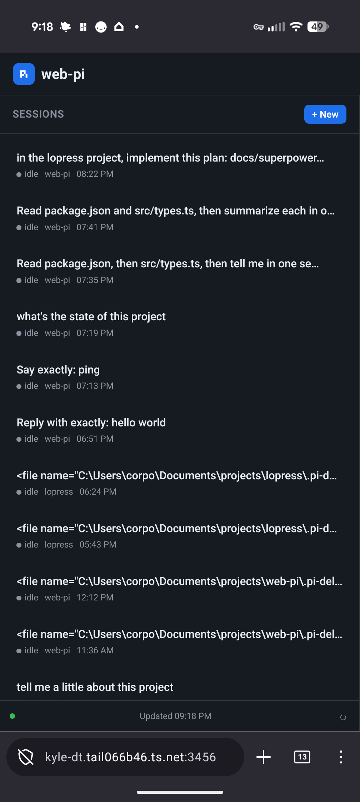
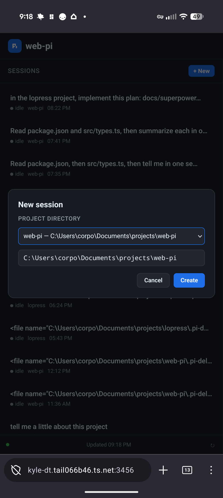
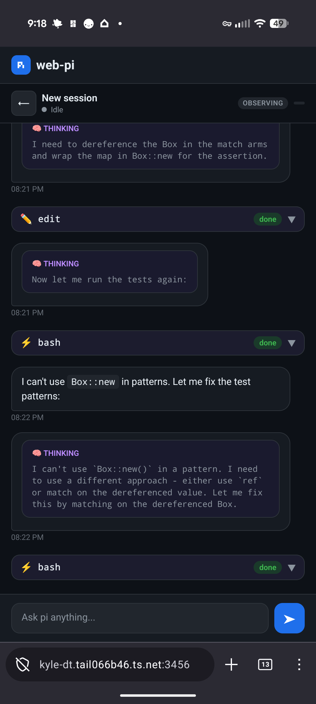

# web-pi

Remote control for [pi](https://pi.dev) — the minimal terminal coding agent — via WebSocket. Access your pi sessions from any device with a web browser, including your phone.

## Screenshots

<p align="center">
  
  &nbsp;
  
  &nbsp;
  
</p>

On a phone the session list is the full-width home view; tapping a session opens the chat — with live thinking, tool calls, and streaming output — and starting a new session lets you pick the project directory.

## Architecture

```
┌─────────────────────────────────────────────────────┐
│                    Web Browser                       │
│  ┌─────────────┐    ┌──────────────────────────┐    │
│  │ Session List │    │  Chat / Activity View    │    │
│  │              │    │                          │    │
│  │ • Current    │◄───│ • Messages               │    │
│  │ • History    │    │ • Streaming output       │    │
│  │ • New (+)    │    │ • Tool calls             │    │
│  └─────────────┘    │ • Input box              │    │
│                     └──────────┬───────────────┘    │
│                              │ WebSocket            │
└──────────────────────────────┼──────────────────────┘
                               │
                    ┌──────────▼───────────┐
                    │   Express + WS Server  │
                    │   (src/server.ts)      │
                    │                        │
                    │  • Command router      │
                    │  • Event broadcaster   │
                    │  • Session lifecycle   │
                    └──────────┬───────────┘
                               │
                    ┌──────────▼───────────┐
                    │   pi SDK (in-process)  │
                    │                        │
                    │  • AgentSession        │
                    │  • SessionManager      │
                    │  • Event subscription  │
                    │  • Tools & extensions  │
                    └────────────────────────┘
```

### Why SDK, not RPC?

| Approach | Pros | Cons |
|----------|------|------|
| **SDK (this)** | Full type safety, direct API access, clean event handling, in-process extensions work | Node.js only, tied to single process |
| **RPC mode** | Language-agnostic, process isolation | JSONL parsing complexity, subprocess lifecycle, no extension support |
| **Extension** | Native pi integration, installable via `pi install` | Tied to pi process lifecycle, limited to Node.js |

The SDK approach gives us:
- **Direct event subscription** — pi's event system maps naturally to WebSocket broadcasts
- **Session management** — `SessionManager` handles listing, branching, compaction
- **Extension support** — any installed extensions work automatically
- **Type safety** — full TypeScript types throughout

## Quick Start

```bash
# Install dependencies
npm install

# Start the server
npm run dev
```

Open `http://localhost:3456` in your browser. The server will:
1. Discover existing pi sessions from your working directory
2. Let you connect to any session or create a new one
3. Stream real-time output (messages, tool calls, thinking) to your browser

## Features

- **Session management** — List, connect to, and create sessions; choose the project directory for new ones
- **Real-time streaming** — Messages, thinking, and tool calls render live, with full-fidelity replay of session history
- **Resilient sessions** — Tasks keep running if you close the browser or phone, and reconnecting auto-resumes the session
- **Mobile-friendly** — Responsive single-page UI that works well on phones
- **Abort** — Stop a running task with one click
- **Hand off to pi-CLI** — Release a session so the terminal `pi` can take over

## WebSocket Protocol

### Client → Server Commands

| Command | Description |
|---------|-------------|
| `list_sessions` | Get list of available sessions |
| `connect_session` | Connect to a session by file path |
| `disconnect_session` | Disconnect from current session |
| `release_session` | Release ownership so the terminal `pi` can drive the session |
| `prompt` | Send a message to pi |
| `abort` | Abort the current operation |
| `new_session` | Create a new session (optionally in a chosen working directory) |
| `set_session_name` | Set the display name for a session |
| `get_state` | Get current session state |
| `get_messages` | Get all messages in current session |

### Server → Client Events

| Event | Description |
|-------|-------------|
| `session_list` | List of available sessions |
| `session_update` | Session state changed (streaming, message count) |
| `message` | New message in conversation |
| `streaming` | Streaming text delta |
| `tool` | Tool call event (start/update/end) |
| `queue_update` | Steering/follow-up queue changed |
| `compaction` | Compaction started/finished |
| `error` | Error message |

## Customization Ideas

### What's easy to add:
- **Model switching** — Add a dropdown to switch models
- **Thinking level control** — Add a slider for thinking level
- **Session naming** — Edit session names inline
- **Dark/light theme toggle** — CSS variable swap
- **Session export** — Export conversation as HTML/markdown
- **Push notifications** — Notify when pi finishes
- **Multiple server instances** — Per-project servers

### What would need more work:
- **Extension UI** — Some extensions use TUI-specific features that don't translate to web
- **File browsing** — Would need a file tool with upload/download
- **Image support** — Would need image upload + display
- **Multi-user** — Would need authentication and session isolation

## Running on your phone

The easiest and most secure option is [Tailscale](https://tailscale.com) — a
zero-config WireGuard mesh VPN. Install it on both your computer and your phone,
sign into the same account, and your devices can reach each other directly over
an encrypted connection from anywhere, with no ports exposed to the public
internet.

1. Install Tailscale on your computer and phone, signed into the same account
2. Start the server: `npm run dev`
3. From your phone, visit `http://<your-machine>.<your-tailnet>.ts.net:3456`
   (find the hostname with `tailscale status`, or enable [MagicDNS](https://tailscale.com/kb/1081/magicdns))

Because Tailscale links your own devices privately, there's no public endpoint
to lock down — a good fit since web-pi has no authentication of its own.

### On your local network

If your phone is on the same Wi-Fi, you can skip the VPN:

1. Find your computer's local IP: `ipconfig` (Windows) or `ifconfig` (Mac/Linux)
2. From your phone, visit `http://<your-ip>:3456`
3. Make sure the port isn't blocked by your firewall

### Other tunnels

Tailscale is recommended, but any tunnel works — e.g. a Cloudflare Tunnel, an
SSH reverse tunnel, or `ngrok http 3456`. Note these expose the server publicly,
so put authentication in front of it first.

## Project Structure

```
web-pi/
├── src/
│   ├── server.ts       # Express + WebSocket server, session management
│   └── types.ts        # TypeScript types for the protocol
├── public/
│   └── index.html      # Mobile-first web UI (single file, no framework)
├── package.json
├── tsconfig.json
└── README.md
```

## Development

```bash
# Watch mode with auto-restart
npm run dev

# Build TypeScript
npm run build
```

## License

MIT
